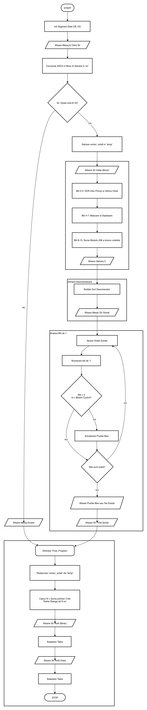

# proiect-asc

## Documentația generală

Prima parte a programului permite introducerea de la tastatură a unui număr de 8–16 octeți în format hexazecimal, separați prin spațiu. Citirea se face folosind întreruperea DOS INT 21h, funcția AH = 0Ah, care salvează caracterele introduse într-un buffer.

În continuare, implementează calculul unei valori compuse C pe 16 de biți, obținută prin operații pe biți aplicate asupra unui șir de octeți. Valoarea C este construită astfel: pentru a afla biții 0-3 se face XOR între primii 4 biți ai primului octet și ultimii 4 biți ai ultimului octet, pentru biții 4-7 se face OR între biții 2-5 ai fiecarui octet din șir, iar pentru ultimii biți, respectiv 8-15 se calculează suma tuturor octeților iar rezultatul se face modulo 256. 

A treia parte a proiectului are ca scop procesarea și analiza șirului de octeți. Obiectivul principal este dublu: ordonarea șirului: reorganizarea octeților în memorie în ordine descrescătoare și analiza binară: identificarea octetului care conține cel mai mare număr de biți de 1 (cu condiția ca acest număr să fie strict mai mare de 3) și afișarea poziției acestuia.

În ultima parte a programului, Pentru fiecare octet din șir, programul calculează un număr N de rotiri bazat pe biții cei mai semnificativi și efectuează o rotire la stânga. Rezultatele sunt afișate pe ecran atât în format binar, cât și hexazecimal.  

## Explicarea structurii

După citire, programul parcurge caracterele introduse și ignoră spațiile. Fiecare octet este format din două caractere hexazecimale consecutive. Aceste caractere sunt convertite din format ASCII în valori binare cu ajutorul unei subrutine dedicate. Primul caracter este deplasat pe partea superioară, iar al doilea pe partea inferioară, rezultând astfel un octet complet.
Octeții rezultați sunt salvați într-un șir și numărați pe parcurs. La finalul conversiei se verifică dacă numărul de octeți se află în intervalul cerut (8–16). Dacă numărul este invalid, se afișează un mesaj de eroare. După conversie, octeții sunt extrași din memorie și procesați prin shiftări succesive la stânga (SHL). Fiecare bit din Carry Flag este transformat în caracterul '0' sau '1' și afișat pe ecran.

În continuare, am izolat biții corespunzători din octeții ceruți, respectiv primul și ultimul octet din șir. I-am mutat pe aceleași poziții astfel încât să se poată folosi operația cerută, apoi i-am pus în registrul ce reține rezultatul final. Pentru al doilea pas, am folosit o buclă, ce parcurge șirul de octeți unul câte unul, pentru a face operația OR între biții corespunzători ai fiecărui octet, biți ce au fost izolați mai întâi. La final, aceștia sunt mutați pe pozițiile corespunzătoare și puși în rezultat. Pentru ultimul pas, în buclă, se adună pe rând fiecare octet și rezultatul cerut se mută în registrul ce va conține la final cuvântul C. Pentru afișare, am apelat o procedură ce afișează registrul ax sub formă de număr hexadecimal pe 4 cifre. În buclă, se face o rotire astfel încât următorul grup de 4 biți să ajungă in partea superioară a registrului inferior(al). Aceștia sunt izolați, apoi convertiti în caractere ale codului ASCII, cifrele de la 0 la 9 în mod direct, adăugând codul ASCII al lui 0, iar valorile de la 10 la 15 sunt convertite în litere prin adăugarea cifrei 7.(A →65, 9→58,  65-58=7). Fiecare caracter obținut este afișat imediat, iar bucla se repetă de 4 ori, pentru a afișa întreaga valoare pe 16 biți.

Procesarea șirului de octeți este structurată în trei etape succesive: sortarea șirului, analiza biților și afișarea rezultatului. Ordonarea octeților se realizează folosind algoritmul Bubble Sort, adaptat pentru ordine descrescătoare. Prin două bucle imbricate, se compară elementele adiacente sir[si] și sir[si+1]. Instrucțiunea CMP urmată de JAE decide dacă este necesară interschimbarea valorilor, asigurând plasarea elementelor mai mari la începutul șirului. După sortare, fiecare octet este analizat pentru a determina numărul de biți de 1. Numărarea se face prin deplasări succesive la stânga (SHL) și acumularea valorii din Carry Flag folosind ADC. Sunt luați în considerare doar octeții cu mai mult de 3 biți de 1. Dacă numărul obținut depășește valoarea maximă curentă, se actualizează atât maximul, cât și poziția corespunzătoare din șir. Poziția octetului identificat este convertită din hexazecimal în zecimal prin împărțiri succesive la 10, iar rezultatul este afișat pe ecran sub formă de caractere ASCII.

Ultima parte a programului se ocupă de rotirea și afișarea octeților din șir, fiind implementată prin mai multe proceduri apelate secvențial. Pentru fiecare octet, sunt extrași cei mai semnificativi doi biți (bitul 7 și bitul 6), iar suma acestora determină numărul de rotiri la stânga efectuate asupra valorii curente, folosind instrucțiunea ROL. Dacă valoarea calculată este diferită de zero, rotirea este aplicată de N ori, iar rezultatul este salvat înapoi în șir. După procesare, fiecare octet este afișat atât în format binar, cât și hexazecimal. Reprezentarea binară este obținută prin parcurgerea bit cu bit a octetului din registrul AL, fiecare bit fiind afișat ca caracterul ASCII corespunzător (‘0’ sau ‘1’) utilizând întreruperea DOS INT 21h. Afișarea hexazecimală se realizează prin separarea valorii în două grupe de câte 4 biți, care sunt convertite în caractere ASCII corespunzătoare cifrelor 0–9 și literelor A–F. La final, execuția programului este suspendată prin apelul funcției de așteptare a unei taste, permițând vizualizarea completă a rezultatelor afișate.

## Problemele întâmpinate și rezolvarea lor

•	Prima parte:

- Sincronizarea contorului: Deoarece se folosesc două caractere ASCII pentru a crea un singur octet numeric, a fost necesară decrementarea manuală a lui CX în interiorul buclei pentru a preveni citirea unor date random.

- Gestionarea Spațiilor: Pentru a permite un format lizibil (ex: 3F 7A), am implementat o logică de filtrare care sare peste caracterul 20h (spațiu) fără a afecta procesul de conversie.

- Pierderea Datelor în Registre: Utilizarea buclelor imbricate cauza suprascrierea contorului CX. Problema a fost rezolvată prin utilizarea stivei (PUSH/POP) pentru a izola contoarele fiecărei bucle.

•	A doua parte:

-	Posibilitatea ca suma tuturor octeților să depășească regiștrii puși la dispoziție: Prin instrucțiunea add dl, al, suma este calculate într-un registru pe 8 biți. În cazul depășirii valorii maxime (255), overflow-ul este eliminat automat, iar în dl se păstrează doar octetul inferior al rezultatului, ceea ce corespunde restului împărțirii la 256. Datorită „distributivității” operației de modulo, rezultatul în acest caz, în care la fiecare adunare se păstrează rezultatul modulo 256, și la acesta se aduna mai departe următorul octet, este egal cu cel în care se face întâi de toate suma și la final se face operația de modulo 256. 

•	A treia parte:

-	Gestionarea registrelor în bucle imbricate: Atât bucla principală de parcurgere a șirului, cât și bucla interioară de numărare a biților utilizează registrul CX. Acest lucru ducea inițial la pierderea valorii contorului exterior și la execuții incorecte sau bucle infinite. Problema a fost rezolvată prin utilizarea stivei, salvând valoarea lui CX cu PUSH înainte de intrarea în bucla interioară și restaurând-o cu POP după finalizarea acesteia.

-	Afișarea pozițiilor mai mari de 9: În cazul în care poziția octetului cu număr maxim de biți depășea valoarea 9, afișarea directă a unui singur caracter ASCII producea rezultate incorecte. Soluția a constat în conversia poziției din format hexazecimal în format zecimal prin împărțiri succesive folosind instrucțiunea DIV, separând cifra zecilor de cifra unităților și evitând afișarea unei cifre de ordin superior nulă.

-	Integrarea cu datele celorlalte module: Codul depindea de variabilele sir și contor_octeti definite în alte secțiuni ale programului. Pentru a asigura funcționarea corectă, codul a fost structurat modular, cu etichete clare, și testat după integrarea completă a secvenței de citire înainte de implementarea logicii de sortare și analiză.

•	A patra parte:

-	Determinarea numărului de rotiri: Calculul valorii N pe baza biților 7 și 6 ai octetului a necesitat izolarea corectă a acestora înainte de efectuarea operației de rotire. Problema a fost rezolvată prin mascarea biților și utilizarea valorii obținute pentru a controla numărul de execuții ale instrucțiunii ROL.

-	Afișarea corectă a reprezentării binare: Afișarea bit cu bit a unui octet a impus gestionarea atentă a Carry Flag, întrucât fiecare deplasare modifica starea acestuia. Soluția a constat în utilizarea instrucțiunilor SHL și ADC pentru a transforma valoarea din CF în caracterele ASCII corespunzătoare (‘0’ și ‘1’).

-	Conversia în format hexazecimal: Conversia valorii octetului în format hexazecimal a necesitat separarea corectă a celor două semiocteți și maparea valorilor peste 9 la literele A–F. Această problemă a fost rezolvată prin ajustarea codului ASCII, obținând o afișare corectă și lizibilă.

## Diagrama bloc

